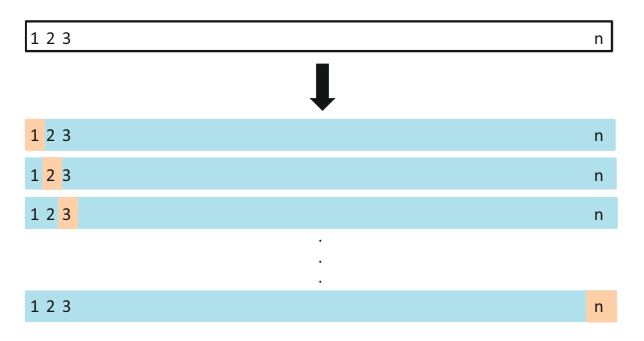
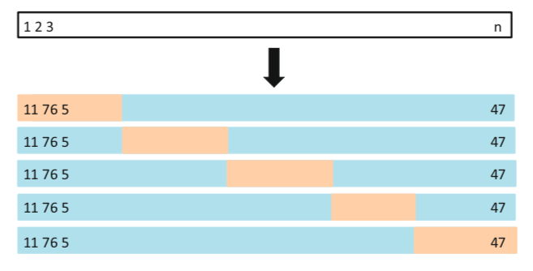

```{r setup, include=FALSE}
knitr::opts_chunk$set(echo = TRUE,warning=F)
options(scipen=999)
library(tidyverse)    #Essential Functions
library(modelr)       #Helpful Functions in Modeling
library(purrr)
library(broom)
DATA=read_csv("AirWaterTemp.csv",col_types=cols()) #River Data
```

# Introduction

We will continue our work with daily water temperature and air temperature data observed for `r length(unique(DATA$L))` rivers in Spain. In the preview below, `W` represents the daily maximum water temperature and `A` represents the daily maximum air temperature. The data contains almost a full year of data for each of the `r length(unique(DATA$L))` different rivers.

```{r,echo=F}
head(DATA)
```

Using the data, we seek to identify the best model for predicting the maximum water temperature given the maximum air temperature. Previously, we randomly selected 3 rivers to act as a test set. All models were evaluated based on the randomly selected test set. In this tutorial, we explore approaches that ensure that all data is used for both model training and model testing.

In this tutorial, we apply helpful functions in the `purrr`, `modelr`, and `broom` packages. See the following links for helpful articles on performing cross-validation within the tidyverse: [Link 1](https://sjspielman.github.io/bio5312_fall2017/files/kfold_supplement.pdf), [Link 2](https://drsimonj.svbtle.com/k-fold-cross-validation-with-modelr-and-broom), and [Link 3](https://www.r-bloggers.com/easy-cross-validation-in-r-with-modelr/).


# Part 1: Intelligent Use of Locations for Cross-Validation

## Chunk 1: List-Column of Data Split By Location
```{r,eval=T,message=F}
NEST.DATA = DATA %>% group_by(L) %>% nest()
head(NEST.DATA)
```


## Chunk 2: Combining `filter()` with `unnest()` To Split Data
```{r,eval=T,message=F}
NEST.DATA %>% filter(L==103) %>% unnest() %>% glimpse()
NEST.DATA %>% filter(L!=103) %>% unnest() %>% glimpse()
DATA%>% filter(L==103)
```

## Chunk 3: Fit Train Data, Predict Test Data, and Save Results
```{r,eval=T}
DATA2=DATA
DATA2$linpred=NA

TEST = NEST.DATA %>% filter(L==103) %>% unnest()
TRAIN  = NEST.DATA %>% filter(L!=103) %>% unnest()

linmod=lm(W~A,data=TRAIN)
linmodpred=predict(linmod,newdata=TEST)
DATA2$linpred[which(DATA2$L==103)]=linmodpred
head(DATA2)

```

## Chunk 4: Create a Loop to Iterate Process for Each Location
```{r,eval=F}
DATA2=DATA
DATA2$linpred=NA

for (i in unique(DATA$L)){
  TEST = NEST.DATA %>% filter(L==i) %>% unnest()
TRAIN  = NEST.DATA %>% filter(L!=i) %>% unnest()

linmod=lm(W~A,data=TRAIN)
linmodpred=predict(linmod,newdata=TEST)
DATA2$linpred[which(DATA2$L==i)]=linmodpred}
DATA2


```

## Chunk 5: Calcuate Cross-Validated RMSE
```{r,eval=F}
RMSE.func=function(actual,predict){
  mse=mean((actual-predict)^2,na.rm=T)
  rmse=sqrt(mse)
  return(rmse)
}


RMSE.func(DATA2$W,DATA2$linpred)
```


# Part 2: K-Fold CV for Polynomial Model Evaluation

## Cross Validation

- One way to evaluate and compare the performance of different models

```{r fig.align="center", echo=FALSE, out.width = '60%'}

```

- Leave-one-out cross-validation
    - repeatedly fit the statistical learning method using training sets that contain $n - 1$ observations, and get the prediction of the excluded observation.
    $$
    CV_{(n)} = \frac{1}{n}\sum_{i=1}^n MSE_i
    $$
    where $MSE_i = (y_i-\hat{y}_i)^2$ based on $x_i$ and model fitted by $\{(x_1,y_1),...,(x_{i-1},y_{i-1}),(x_{i+1},y_{i+1}),...,(x_n,y_n)\}$.
    - there is no randomness in the training/validation set splits; performing LOOCV multiple times will always yield the same results.
    - can also be used in the classification setting by replacing $MSE_i$ with error rate $Err_i = I(y_i\neq \hat{y_i})$
    
```{r fig.align="center", echo=FALSE, out.width = '60%'}

```

- K-fold cross-validation
    - involves randomly dividing the set of observations into k groups of approximately equal size. The first fold is treated as a validation set, and the method is fit on the remaining k-1 folds. The mean squared error, $MSE_1$, is then computed on the observations in the held-out fold. This procedure is repeated k times.
    $$
    CV_{(k)} = \frac{1}{k}\sum_{i=1}^k MSE_i
    $$
    
    
## Chunk 1: Exploratory Figures
```{r,echo=F,eval=F}
ggplot(data=DATA) +
  geom_point(aes(x=JULIAN_DAY,y=W,color=A),alpha=0.3) + 
  xlab("Day of Year") + ylab("Max Water Temperature") +
  guides(color=guide_legend(title="Max Air \nTemperature")) +
  theme_minimal()
```

## Chunk 2: Polynomial Fitting
```{r,eval=F}
polymodel=lm(W~poly(A,4)+poly(JULIAN_DAY,3),data=na.omit(DATA))
tidy(polymodel)
glance(polymodel)
```

## Chunk 3: Splitting Data for Cross-Validation
```{r,eval=F}
DATA3=na.omit(DATA) %>% crossv_kfold(10)
DATA3
```

## Chunk 4: Fitted Models and Predictions
```{r,eval=F}
train.model.func=function(data,i,j){
  mod=lm(W~poly(A,i)+poly(JULIAN_DAY,j),data=data)
  return(mod)
}
i=4
j=3


DATA4=DATA3 %>% mutate(tr.model=map(train,train.model.func,i=i,j=j))
DATA4
```

## Chunk 5: Predicted Values and Cross-Validated RMSE
```{r,eval=F}
DATA4.PREDICT = DATA4 %>% 
          mutate(predict=map2(test,tr.model,~augment(.y,newdata=.x))) %>%
          select(predict) %>%
         unnest()


head(DATA4.PREDICT)
RMSE.func(actual=DATA4.PREDICT$W,predict=DATA4.PREDICT$.fitted)

```

## Chunk 6: Select Best (i,j) Pair

```{r, eval=F}
max_i = 10
max_j = 10
rmse_results = matrix(NA,max_i,max_j)


for (i in 1:10){
  for (j in 1:10){
    DATA5=DATA3 %>% 
       mutate(tr.model=map(train,train.model.func,i=i,j=j))
    DATA5.PREDICT = DATA5 %>% 
          mutate(predict=map2(test,tr.model,~augment(.y,newdata=.x))) %>%
          select(predict) %>%
          unnest()
    
    r=RMSE.func(actual=DATA5.PREDICT$W,predict=DATA5.PREDICT$.fitted)
    rmse_results[i,j]=r
  }
```


```{r, eval=F}
rank(rmse_results)
```

```{r, eval=F}
which(rmse_results==min(rmse_results), arr.ind = T)
```

# Part 3: Exercise on Simulated Data

1. We will now perform cross-validation on a simulated data set.

(a) Generate a simulated data set as follows:
n=100 and p=2, the model used is
$$
Y = X - 2X^2 + \epsilon
$$
$\epsilon$ here follow standard normal distribution. 

```{r, eval=F}
set.seed(216)
x=rnorm(100)
y=x-2*x^2+rnorm(100)
sim=tibble(predictor=x,response=y)
```


(b) Create a scatterplot of X against Y. Comment on what you find.
```{r}
plot(x,y,pch="*")
```

Comment: ANSWER_HERE.

(c) Compute the 5-Fold RMSE that result from fitting the following four models:

i. $Y = \beta_0 + \beta_1X + \epsilon$

ii. $Y = \beta_0 + \beta_1X + \beta_2X^2 + \epsilon$

iii. $Y = \beta_0 + \beta_1X + \beta_2X^2 + \beta_3X^3 + \epsilon$

iv. $Y = \beta_0 + \beta_1X + \beta_2X^2 + \beta_3X^3 + \beta_4X^4 + \epsilon$

```{r, eval=F}
max_i = 4
rmse_ex = rep(NA,max_i)
train.model.func2 = function(data,i){
  mod=lm(response~poly(predictor,i),data=data)
  return(mod)
}


for(i in 1:max_i){
  sim_final = sim %>%
  crossv_kfold(5)%>%
  mutate(tr.model=map(train,train.model.func2,i=i))%>%
    mutate(predict=map2(test,tr.model,~augment(.y,newdata=.x)))%>%
  select(predict) %>%
  unnest()
  rmse_ex[i] = RMSE.func(sim_final$response,sim_final$.fitted)
}
rmse_ex

```

Check which model has the smallest RMSE:
```{r,eval=F}
rmse_ex
```

(d) Which of the models in (c) had the smallest RMSE? Is
this what you expected? Explain your answer.

ANSWER_HERE
```{r}
x<-tibble(a=c("a","b","c"),b=c("A","a","b"))
x%>%count()

```
